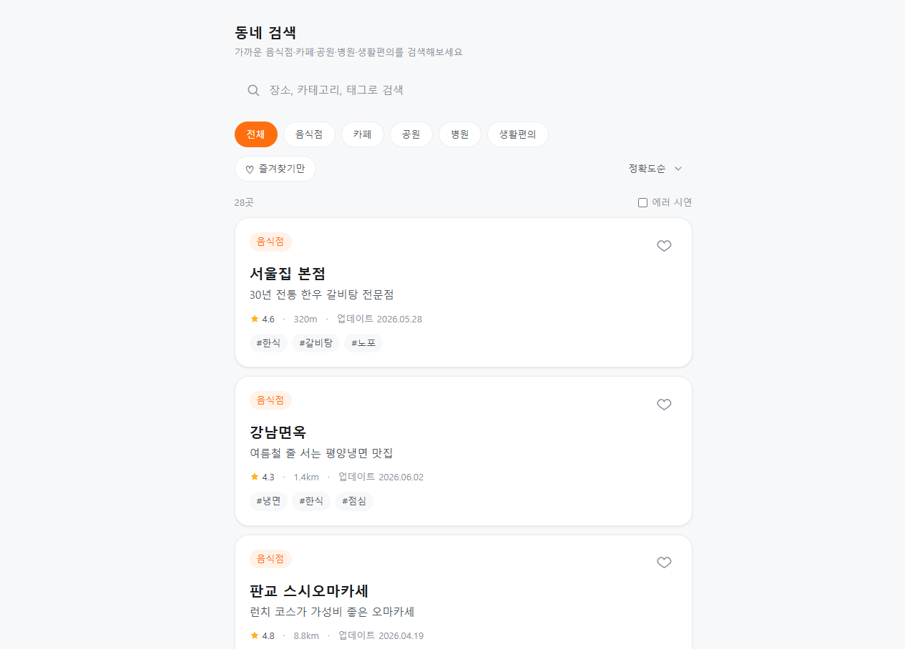
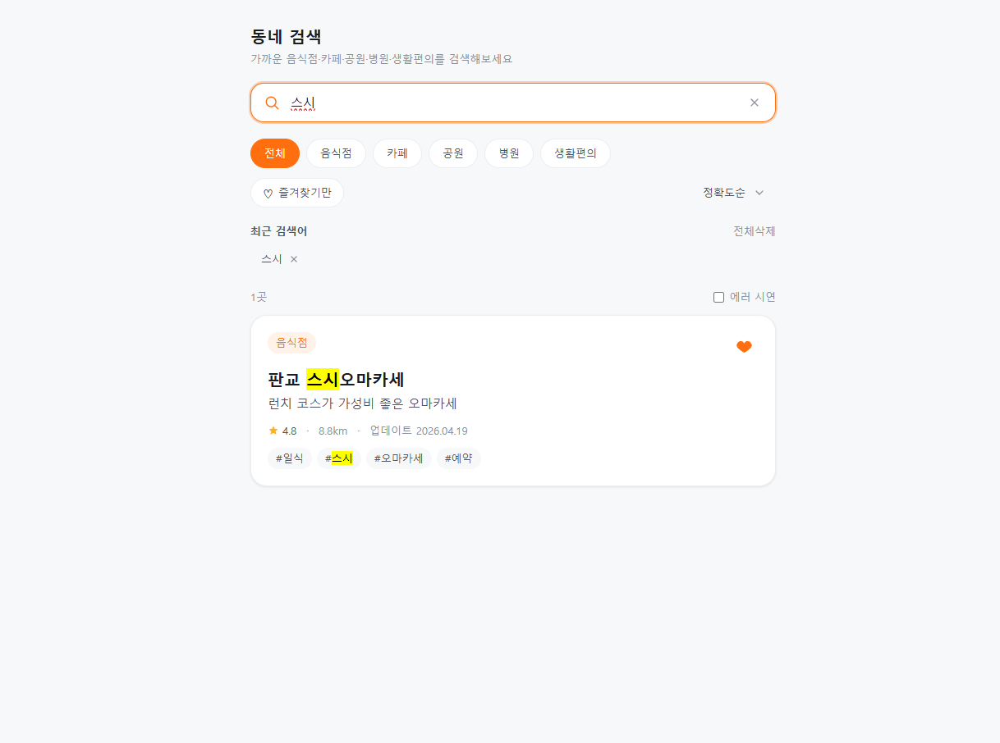

# Local Search Playground

> 검색, 정렬, 필터링, 최근 검색어, 즐겨찾기 기능을 구현하며 정보 탐색 경험(Search Experience)을 실험한 React + TypeScript 프로젝트

| 둘러보기                                   | 검색 · 하이라이팅 · 즐겨찾기                             |
| -------------------------------------- | --------------------------------------------- |
|  |  |

> 왼쪽: 전체 장소 둘러보기(카테고리·정렬·즐겨찾기 필터). 오른쪽: "스시" 검색 시 일치 구간 하이라이팅 + 최근 검색어 + 즐겨찾기 표시.

---

## 프로젝트 소개

서비스를 사용하다 보면 원하는 정보를 찾기 위해 여러 번 검색하거나 필터를 변경하는 경우가 많습니다.

특히 검색 결과의 정렬 방식, 카테고리 필터, 최근 검색어, 즐겨찾기 같은 기능들은 각각 단순해 보이지만 실제로는 사용자의 탐색 비용을 줄이는 데 중요한 역할을 합니다.

이 프로젝트는 검색 결과를 단순히 나열하는 것을 넘어 사용자가 원하는 정보를 더 빠르게 발견할 수 있도록 검색 경험을 개선하는 과정에 관심을 가지게 되면서 시작했습니다.

검색어 하이라이팅, 디바운스 처리, 정렬, 필터링, 최근 검색어, 즐겨찾기 기능을 직접 구현하며 검색 UX를 구성하는 요소들을 실험하고 정리했습니다.

---

## 주요 기능

### 검색

* 300ms Debounce 기반 검색
* 빈 검색어 입력 시 전체 데이터 표시
* 검색 결과 실시간 반영

### 검색어 하이라이팅

* 검색 결과의 장소명
* 설명
* 태그

일치 구간을 강조 표시

예시

검색어

서울

결과

서울역

서울숲

서울시청

---

### 카테고리 필터

* 전체
* 음식점
* 카페
* 공원
* 병원
* 생활편의

선택된 카테고리 기준으로 결과 필터링

---

### 정렬

* 정확도순
* 최신순
* 거리순
* 평점순

정렬 기준에 따라 결과 순서 변경

---

### 최근 검색어

LocalStorage 기반

* 최대 5개 저장
* 중복 제거
* 재검색
* 개별 삭제
* 전체 삭제

---

### 즐겨찾기

LocalStorage 기반

* 즐겨찾기 추가
* 즐겨찾기 제거
* 즐겨찾기만 보기

---

### Empty State

조건에 맞는 결과가 없는 경우 사용자 안내 메시지 표시

---

### 상태 처리

TanStack Query 기반

* Loading
* Error
* Success

상태 분리

Mock API를 사용해 비동기 환경 구성

---

## 기술 스택

| 분류         | 사용 기술                           |
| ---------- | ------------------------------- |
| UI         | React 19, TypeScript            |
| Build Tool | Vite                            |
| State      | TanStack Query                  |
| Storage    | LocalStorage                    |
| Styling    | TailwindCSS                     |
| API        | Mock API (Promise + setTimeout) |

---

## 아키텍처

타입 → 훅 → 컴포넌트 → 화면 조립 구조로 구성했습니다.

```txt
src/
├─ types/
├─ data/
├─ api/
├─ hooks/
├─ utils/
├─ components/
├─ App.tsx
└─ main.tsx
```

데이터 흐름

```txt
사용자 입력
    ↓
useDebounce
    ↓
usePlaceSearch
    ↓
필터링
정렬
검색
    ↓
결과 렌더링
```

---

## 실행 방법

```bash
npm install
npm run dev
```

| Script | 설명 |
| --- | --- |
| `npm run dev` | 개발 서버 |
| `npm run build` | 프로덕션 빌드 |
| `npm run preview` | 빌드 결과 확인 |
| `npm run lint` | ESLint 검사 |
| `npm run typecheck` | 타입 검사 |
| `npm run test` | 단위 테스트 (Vitest) |

---

## 배운 점

### 검색 UX는 단순 필터링이 아니다

검색 기능은 결과를 보여주는 것보다 사용자가 원하는 정보에 더 적은 단계로 도달하도록 돕는 과정이라는 점을 경험했습니다.

---

### 파생 상태는 저장하지 않는다

필터링과 정렬 결과를 별도 상태로 저장하지 않고 계산 기반으로 처리하여 상태 동기화 문제를 줄였습니다.

---

### TypeScript의 장점

데이터 모델과 인터페이스를 먼저 정의하면서 컴포넌트 간 계약을 명확하게 유지할 수 있었습니다.

---

### 재사용 가능한 훅 설계

useDebounce, useLocalStorage 등을 제네릭 기반으로 구현하여 다양한 기능에 재사용할 수 있도록 구성했습니다.

---

## 포트폴리오 설명

검색 결과를 보여주는 화면부터 상태 관리, 사용자 행동을 고려한 UX 요소까지 직접 설계하고 구현한 프로젝트입니다.

검색어 하이라이팅, 정렬, 필터링, 최근 검색어, 즐겨찾기 기능을 통해 정보 탐색 과정에서 발생하는 불편함을 줄이는 데 초점을 맞췄습니다.

또한 React와 TypeScript를 활용해 타입 중심 설계, 커스텀 훅 분리, 컴포넌트 재사용성을 고려한 구조로 구현하며 프론트엔드 애플리케이션을 체계적으로 구성하는 방법을 정리했습니다.
